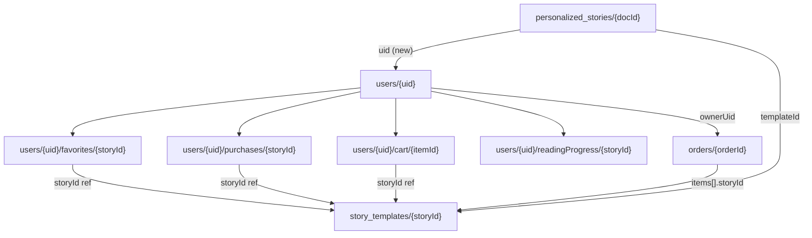

# Firebase (Firestore) User-Data Structure Plan

---

## 1) What Already Exists

The codebase already uses these Firestore collections:

| Collection | Purpose | Key fields |

|---|---|---|

| `storyBriefs` | Specialist therapeutic briefs | `createdBy`, `status`, `therapeuticFocus`, `childProfile`, `therapeuticIntent`, `languageTone`, `safetyConstraints`, `storyPreferences` |

| `storyDrafts` | AI-generated story drafts | `briefId`, `createdBy`, `status`, `title`, `pages[]`, `generationConfig` |

| `story_templates` | Approved/published stories (the "catalog") | `title`, `status`, `ageGroup`/`targetAgeGroup`, `topicKey`, `pages[]`, `coverImage`, `shortDescription` |

| `personalized_stories` | Per-child personalized copies | `templateId`, `child.name`, `child.gender`, `createdAt` |

| `draft_suggestions` | AI edit suggestions on drafts | `draftId`, `briefId`, `instruction`, `suggestedText`, `status` |

| `review_sessions` | Specialist review conversations (with `messages` and `proposals` subcollections) | `draftId`, `status` |

| `referenceData/{subcollection}/items` | Enum data (topics, situations, emotionalGoals, exclusions) | `label_en`, `label_ar`, `label_he`, `active` |

| `rag_theme_patterns` | RAG knowledge base | topic/age pattern data |

| `rag_writing_rules` | RAG writing guidelines | rule documents |

**What does NOT exist yet:** `users` collection, favorites, purchases, orders, cart -- none of these have any Firestore backing. The login page ([client/src/pages/LoginPage.tsx](client/src/pages/LoginPage.tsx)) is UI-only with no Firebase Auth integration. The cart route renders a placeholder page.

---

## 2) Proposed Firestore Schema



### 2.1 `users/{uid}`

Created on first sign-in (Firebase Auth `onCreate` trigger or client-side check).

```json
{
  "displayName": "Ahmad",
  "email": "ahmad@example.com",
  "photoURL": "https://...",
  "role": "parent",
  "languagePreference": "ar",
  "createdAt": "Timestamp",
  "updatedAt": "Timestamp",
  "favoritesCount": 3,
  "purchasesCount": 5,
  "cartItemCount": 1
}
```

- `role`: `"parent"` | `"specialist"` | `"admin"` -- drives UI and security rules.
- `favoritesCount`, `purchasesCount`, `cartItemCount`: denormalized counters for badge/UI without querying subcollections. Updated via batched writes or Cloud Functions.

### 2.2 `users/{uid}/favorites/{storyId}`

Document ID = story template ID (prevents duplicates, enables O(1) existence check).

```json
{
  "storyId": "abc123",
  "title": "The Brave Little Star",
  "coverImage": "/story-images/star.jpg",
  "addedAt": "Timestamp"
}
```

- `title` and `coverImage` are **intentionally denormalized** so "My Favorites" list renders without N extra reads to `story_templates`.

### 2.3 `users/{uid}/purchases/{storyId}`

Document ID = story template ID (one entitlement per story per user).

```json
{
  "storyId": "abc123",
  "title": "The Brave Little Star",
  "coverImage": "/story-images/star.jpg",
  "orderId": "order_456",
  "pricePaid": 4.99,
  "currency": "ILS",
  "purchasedAt": "Timestamp"
}
```

- This is the **entitlement record** -- if this doc exists, user can access premium content.
- `orderId` links back to the full order for receipts/refunds.

### 2.4 `users/{uid}/cart/{itemId}`

```json
{
  "storyId": "abc123",
  "title": "The Brave Little Star",
  "coverImage": "/story-images/star.jpg",
  "price": 4.99,
  "currency": "ILS",
  "addedAt": "Timestamp"
}
```

- Auto-generated doc ID (not storyId as ID, since pricing or bundling may vary).
- Cleared after successful checkout.

### 2.5 `users/{uid}/readingProgress/{storyId}`

```json
{
  "storyId": "abc123",
  "currentPage": 3,
  "totalPages": 10,
  "lastReadAt": "Timestamp",
  "completed": false,
  "personalization": {
    "childName": "سارة",
    "gender": "female"
  }
}
```

- Replaces the current `localStorage`-based personalization in [BookReaderPage.tsx](client/src/pages/BookReaderPage.tsx).

### 2.6 `orders/{orderId}`

Top-level collection (not nested under user) so admins/backend can query all orders.

```json
{
  "uid": "user_789",
  "items": [
    {
      "storyId": "abc123",
      "title": "The Brave Little Star",
      "price": 4.99
    }
  ],
  "subtotal": 4.99,
  "currency": "ILS",
  "status": "pending",
  "paymentMethod": "stripe",
  "paymentIntentId": "pi_xxx",
  "createdAt": "Timestamp",
  "paidAt": null,
  "fulfilledAt": null
}
```

- `status`: `"pending"` | `"paid"` | `"fulfilled"` | `"refunded"` | `"failed"`
- Only the server/Cloud Function sets `status` to `"paid"` after payment confirmation.
- On `"paid"`, a Cloud Function writes entitlement docs into `users/{uid}/purchases/{storyId}`.

### 2.7 `story_templates/{storyId}` (existing, enhanced)

Add these fields to the existing documents:

```json
{
  "...existing fields...",
  "createdByUid": "user_789",
  "pricing": {
    "type": "free",
    "price": 0,
    "currency": "ILS"
  },
  "favoritesCount": 42,
  "purchaseCount": 120,
  "visibility": "public"
}
```

- `pricing.type`: `"free"` | `"paid"` -- determines whether purchase is required.
- `favoritesCount` / `purchaseCount`: denormalized popularity counters (updated by Cloud Functions).
- `visibility`: `"public"` | `"private"` | `"unlisted"`.

---

## 3) Relationships Explained

| Relationship | How it works |

|---|---|

| One user -> many favorites | Subcollection `users/{uid}/favorites/` -- each doc is one favorite |

| One user -> many purchases | Subcollection `users/{uid}/purchases/` -- each doc is one entitlement |

| One story -> created by one user (or system) | `story_templates.createdByUid` field |

| One story -> purchased by many users | Each buyer gets their own `purchases/{storyId}` doc under their user |

| Orders vs purchases | `orders/{orderId}` = the financial transaction record. `users/{uid}/purchases/{storyId}` = the access entitlement. An order can contain multiple stories. After payment, Cloud Function creates one purchase doc per story. |

---

## 4) Purchased Stories: Option A vs Option B

### Option A: `users/{uid}/purchases/{storyId}` (simple entitlement)

- **Pros:** O(1) access check (`getDoc`), trivial security rules, no joins needed, fast "My Library" query.
- **Cons:** No audit trail of payments unless you add `orderId` reference.

### Option B: `orders/{orderId}` + `entitlements` collection

- **Pros:** Full audit trail, supports refunds/disputes, multi-item orders.
- **Cons:** Extra collection, more complex queries, need Cloud Function to sync.

### Recommendation: Hybrid (A + partial B)

Use both `users/{uid}/purchases/{storyId}` for fast access checks AND `orders/{orderId}` for financial records. The Cloud Function bridge:

```
Payment confirmed -> update orders/{orderId}.status = "paid"
                  -> for each item: write users/{uid}/purchases/{storyId}
                  -> increment users/{uid}.purchasesCount
```

This gives you O(1) entitlement checks with full order history.

---

## 5) Security Rules Plan

Add these rules to [firestore.rules](firestore.rules):

```
// Users: read/write own doc only
match /users/{uid} {
  allow read: if request.auth != null && request.auth.uid == uid;
  allow create: if request.auth != null && request.auth.uid == uid;
  allow update: if request.auth != null && request.auth.uid == uid;
  allow delete: if false;

  // Favorites, cart, readingProgress: owner only
  match /favorites/{docId} {
    allow read, write: if request.auth != null && request.auth.uid == uid;
  }
  match /cart/{docId} {
    allow read, write: if request.auth != null && request.auth.uid == uid;
  }
  match /readingProgress/{docId} {
    allow read, write: if request.auth != null && request.auth.uid == uid;
  }
  // Purchases: owner can read, only server can write
  match /purchases/{docId} {
    allow read: if request.auth != null && request.auth.uid == uid;
    allow write: if false;  // Only Admin SDK (Cloud Function) writes
  }
}

// Orders: owner can read, only server can write status changes
match /orders/{orderId} {
  allow read: if request.auth != null && request.auth.uid == resource.data.uid;
  allow create: if request.auth != null && request.auth.uid == request.resource.data.uid;
  allow update: if false;  // Only Admin SDK can update (payment status)
  allow delete: if false;
}

// Stories: public read for approved, write restricted
match /story_templates/{storyId} {
  allow read: if resource.data.status == "approved"
              && resource.data.visibility == "public";
  allow write: if false;  // Admin SDK only
}
```

---

## 6) Query Plan (How the UI Loads Data)

| UI Need | Query |

|---|---|

| "My favorites" | `getDocs(collection(db, "users", uid, "favorites"))` ordered by `addedAt` desc |

| "My purchased stories" | `getDocs(collection(db, "users", uid, "purchases"))` ordered by `purchasedAt` desc |

| "My created stories" (specialist) | `query(collection(db, "story_templates"), where("createdByUid", "==", uid))` |

| "Story page: owned or needs purchase?" | `getDoc(doc(db, "users", uid, "purchases", storyId))` -- if exists, show content; else show buy button. Also check `story_templates/{storyId}.pricing.type == "free"` |

| "Shopping cart badge count" | Read `users/{uid}.cartItemCount` (denormalized) OR `getDocs(collection(db, "users", uid, "cart"))` and count |

| "Reading progress resume" | `getDoc(doc(db, "users", uid, "readingProgress", storyId))` |

---

## 7) Step-by-Step Implementation Plan

### Phase 1: Firebase Auth + User Profile

1. Integrate Firebase Auth (email + Google) in [client/src/firebase.ts](client/src/firebase.ts)
2. Create `AuthContext` provider with `onAuthStateChanged` listener
3. Build auth middleware on server using [server/src/config/firebase.ts](server/src/config/firebase.ts) `admin.auth().verifyIdToken()`
4. Auto-create `users/{uid}` doc on first login
5. Update [firestore.rules](firestore.rules) with user rules

### Phase 2: Favorites

6. Add favorites service (client-side: add/remove/list from `users/{uid}/favorites`)
7. Add heart icon toggle on story cards and story reader page
8. Build "My Favorites" page

### Phase 3: Shopping Cart + Orders

9. Add cart service (client-side CRUD on `users/{uid}/cart`)
10. Build cart page replacing the current placeholder at route `/cart`
11. Create `orders` collection and checkout API endpoint on server
12. Implement payment integration (Stripe or similar)
13. Cloud Function: on order paid, write purchase entitlements

### Phase 4: Purchases / Entitlements

14. Add `pricing` field to `story_templates` documents
15. Build entitlement check logic in story reader ([BookReaderPage.tsx](client/src/pages/BookReaderPage.tsx))
16. Build "My Library" / purchased stories page

### Phase 5: Reading Progress

17. Save/restore reading progress to Firestore instead of localStorage
18. Migrate personalization data from localStorage to `readingProgress` subcollection

### Phase 6: Enhance story_templates

19. Add `createdByUid`, `visibility`, popularity counters to `story_templates`
20. Cloud Functions for counter maintenance (favorites, purchases)