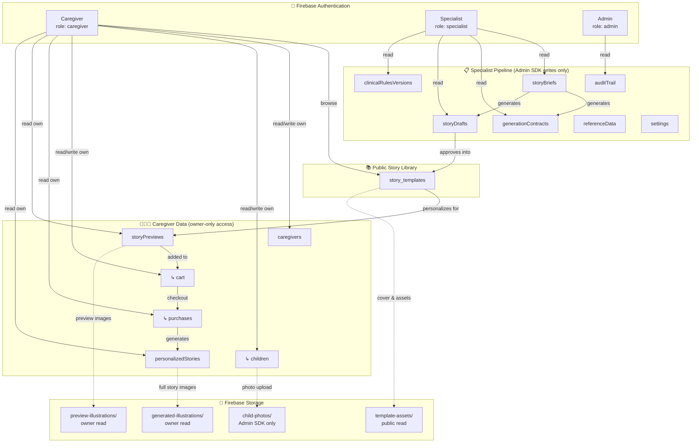

# Firebase Database Architecture

> Personalized Therapeutic Children's Story Platform

---

## Entity-Relationship Diagram

```mermaid
erDiagram
    caregivers ||--o{ children : "subcollection"
    caregivers ||--o{ cart : "subcollection"
    caregivers ||--o{ purchases : "subcollection"
    caregivers ||--o{ storyPreviews : "owns (caregiverUid)"
    caregivers ||--o{ personalizedStories : "owns (caregiverUid)"

    children ||--o{ storyPreviews : "childId"
    children ||--o{ personalizedStories : "childId"

    story_templates ||--o{ storyPreviews : "templateId"
    story_templates ||--o{ personalizedStories : "templateId"

    storyPreviews ||--o| cart : "previewId"
    storyPreviews ||--o| purchases : "previewId"
    storyPreviews ||--o| personalizedStories : "previewId"

    purchases ||--o| personalizedStories : "purchaseId"

    storyBriefs ||--o{ generationContracts : "briefId"
    storyBriefs ||--o{ storyDrafts : "briefId"
    storyDrafts ||--o| story_templates : "approved → template"

    generationContracts ||--o{ history : "subcollection"

    clinicalRulesVersions ||--o{ ageRules : "subcollection"
    clinicalRulesVersions ||--o{ goalMappings : "subcollection"
    clinicalRulesVersions ||--o{ copingTools : "subcollection"
    clinicalRulesVersions ||--o{ endingRules : "subcollection"
    clinicalRulesVersions ||--o{ exclusions : "subcollection"
    clinicalRulesVersions ||--o{ sensitivityRules : "subcollection"

    referenceData ||--o{ items : "subcollection"

    caregivers {
        string uid PK
        string email
        string displayName
        string language "ar | he"
        string paymentCustomerId
        string consentTimestamp
        string consentVersion
        int childCount
        int purchaseCount
        Timestamp createdAt
        Timestamp updatedAt
    }

    children {
        string childId PK
        string firstName
        string gender "male | female"
        string ageGroup "0_3 | 3_6 | 6_9 | 9_12"
        string photoPath
        string photoStatus "none | uploaded | preview_used | processing | deleted | expired"
        string photoUploadedAt
        string photoRetainUntil
        Timestamp createdAt
        Timestamp updatedAt
    }

    cart {
        string cartItemId PK
        string caregiverUid FK
        string previewId FK
        string templateId FK
        string templateTitle
        string childId FK
        string childFirstName
        string coverImageUrl
        int priceCents
        string currency "ILS"
        string language "ar | he"
        Timestamp addedAt
    }

    purchases {
        string purchaseId PK
        string caregiverUid FK
        string previewId FK
        string templateId FK
        string childId FK
        string personalizedStoryId FK
        string paymentTransactionId
        string paymentSessionId
        string paymentChargeId
        int amountCents
        string currency "ILS"
        string status "pending | paid | generation_in_progress | completed | failed | refunded"
        string paidAt
        string completedAt
        string failedAt
        string failureReason
        string refundedAt
        string paymentRefundId
        Timestamp createdAt
        Timestamp updatedAt
    }

    story_templates {
        string id PK
        string draftId FK
        string briefId FK
        string title
        string status "approved"
        string primaryTopic
        string specificSituation
        string ageGroup "0_3 | 3_6 | 6_9 | 9_12"
        object generationConfig "language, targetAgeGroup, length, tone, emphasis"
        string approvedBy
        string approvedAt
        int revisionCount
        boolean isActive
        array pages "StoryTemplatePage[]"
        string slug
        object shortDescription "LocalizedString he/ar"
        string coverImageUrl
        object displayTopic "LocalizedString he/ar"
        boolean isPublished
        Timestamp publishedAt
        int purchaseCount
        int previewPageCount
        int totalPageCount
    }

    storyPreviews {
        string previewId PK
        string caregiverUid FK
        string childId FK
        string templateId FK
        string childFirstName "snapshot"
        string childGender "snapshot"
        string templateTitle "snapshot"
        int templateVersion "snapshot"
        string language "ar | he"
        int previewPageCount
        array pages "PreviewPage[]"
        string coverImageUrl
        string generationStatus "pending | in_progress | completed | failed"
        int pagesCompleted
        string generationStartedAt
        string generationCompletedAt
        string failureReason
        string status "created | generating | ready | added_to_cart | purchased | converted | expired"
        string expiresAt
        string purchaseId FK
        string personalizedStoryId FK
        Timestamp createdAt
        Timestamp updatedAt
    }

    personalizedStories {
        string storyId PK
        string caregiverUid FK
        string childId FK
        string purchaseId FK
        string previewId FK
        string childFirstName "snapshot"
        string childGender "snapshot"
        string templateId FK
        string templateTitle "snapshot"
        int templateVersion "snapshot"
        string language "ar | he"
        string dedicationName
        string coverImageUrl
        string generationStatus "pending | in_progress | completed | failed | partially_failed"
        int totalPages
        int pagesCompleted
        int pagesFromPreview
        array pagesFailedIndexes "number[]"
        string generationStartedAt
        string generationCompletedAt
        array pages "PersonalizedStoryPage[]"
        boolean isAccessible
        Timestamp createdAt
        Timestamp updatedAt
    }

    storyBriefs {
        string id PK
        string createdBy FK "specialist uid"
        string status "created | draft_generating | draft_generated | archived"
        int version
        object therapeuticFocus "primaryTopic, specificSituation"
        object childProfile "ageGroup, emotionalSensitivity"
        object therapeuticIntent "emotionalGoals[], keyMessage"
        object languageTone "complexity, emotionalTone"
        object safetyConstraints "enforced{}, exclusions[]"
        object storyPreferences "caregiverPresence, endingStyle"
        Timestamp lockedAt
        string lockedByDraftId
        Timestamp createdAt
        Timestamp updatedAt
    }

    generationContracts {
        string id PK
        string briefId FK
        string rulesVersionUsed
        string topic
        string situation
        string ageBand
        string caregiverPresence
        string emotionalSensitivity
        object lengthBudget "minScenes, maxScenes, maxWords"
        object styleRules "maxSentenceWords, dialoguePolicy, etc"
        array requiredElements
        array allowedCopingTools
        array mustAvoid
        object endingContract "endingStyle, mustInclude, mustAvoid"
        boolean overrideUsed
        string status "invalid | valid | approved | rejected"
        object approval "ApprovalRecord"
        array previousApprovals
        int overrideCount
        Timestamp createdAt
        Timestamp updatedAt
    }

    history {
        string id PK
        string action
        object details
        Timestamp timestamp
    }

    storyDrafts {
        string id PK
        string briefId FK
        string createdBy FK "specialist uid"
        string status "generating | generated | failed | editing | approved"
        int version
        int revisionCount
        object generationConfig "language, targetAgeGroup, length, tone"
        string title
        array pages "DraftPage[]"
        object error "message, reason"
        string rawModelOutput
        Timestamp approvedAt
        string approvedBy
        Timestamp createdAt
        Timestamp updatedAt
    }

    auditTrail {
        string id PK
        string action "brief.created | contract.built | generation.started | etc"
        object actor "uid, email, displayName, role"
        string resourceType "storyBrief | generationContract | storyDraft"
        string resourceId
        string relatedResourceId
        object metadata
        Timestamp timestamp
    }

    clinicalRulesVersions {
        string versionId PK "e.g. v1"
        string status "active | archived"
        Timestamp createdAt
    }

    ageRules {
        string ageGroupId PK
        int maxWords
        int minScenes
        int maxScenes
        int maxSentenceWords
        string dialoguePolicy
        string abstractConcepts
    }

    goalMappings {
        string goalId PK
        array requiredElements
        array allowedCopingTools
        array avoidPatterns
        boolean requiresClosure
    }

    copingTools {
        string toolId PK
        string displayName
        array allowedAges
        int repetitionRequired
        object contraindications
    }

    endingRules {
        string styleId PK
        array mustInclude
        array mustAvoid
        boolean requiresEmotionalStability
        boolean requiresSuccessMoment
        boolean requiresSafeClosure
    }

    exclusions {
        string exclusionId PK
        string label
        boolean active
    }

    sensitivityRules {
        string level PK "low | medium | high"
        boolean forceSafeClosure
    }

    settings {
        string docId PK "e.g. rules"
        string defaultVersion "e.g. v1"
    }

    referenceData {
        string categoryId PK "topics | situations | emotionalGoals | exclusions"
    }

    items {
        string key PK
        string label_en
        string label_ar
        string label_he
        boolean active
        string topicKey "situations only"
    }
```

---

## Data Flow Diagram

---

## Collection Descriptions

### 🟢 Caregiver-Facing Collections

| Collection | Path | Description |
|---|---|---|
| **caregivers** | `caregivers/{uid}` | Caregiver profile document. Stores display name, language preference (Hebrew/Arabic), payment customer ID, consent info, and aggregate counters (`childCount`, `purchaseCount`). Document ID = Firebase Auth UID. |
| **children** | `caregivers/{uid}/children/{childId}` | Subcollection of child profiles belonging to a caregiver. Contains the child's first name, gender, age group, and photo lifecycle fields (path, status, upload time, 48-hour retention expiry). No PII beyond first name. |
| **cart** | `caregivers/{uid}/cart/{cartItemId}` | Subcollection of cart items awaiting checkout. Each item snapshots the preview, template, child, and price at time of add. Currency is always ILS. |
| **purchases** | `caregivers/{uid}/purchases/{purchaseId}` | Subcollection of purchase records. Tracks the full payment lifecycle (`pending → paid → generation_in_progress → completed`). Written exclusively by the backend Admin SDK; clients have read-only access. Links to preview, template, child, and the resulting personalized story. |
| **storyPreviews** | `storyPreviews/{previewId}` | Top-level collection for story preview sessions. Created when a caregiver requests a preview of a story personalized for their child. Contains snapshotted child/template data, generated preview pages (text + illustration paths), generation progress tracking, and lifecycle status (`created → generating → ready → added_to_cart → purchased → converted`). Readable only by the owning caregiver. |
| **personalizedStories** | `personalizedStories/{storyId}` | Top-level collection for fully generated personalized stories (post-purchase). Contains all pages with personalized text and generated illustration paths. Tracks generation progress, pages copied from preview vs. newly generated, and failed page indexes. Only accessible when `isAccessible === true`. |

### 🔵 Specialist Pipeline Collections

| Collection | Path | Description |
|---|---|---|
| **storyBriefs** | `storyBriefs/{briefId}` | Therapeutic story briefs authored by specialists. Defines the therapeutic focus (topic + situation), abstract child profile (age group, sensitivity), therapeutic intent (emotional goals, key message), language/tone settings, safety constraints, and story preferences. Immutable once a draft is generated. |
| **generationContracts** | `generationContracts/{contractId}` | AI generation contracts built from story briefs using clinical rules. Contains length budgets, style rules, required elements, allowed coping tools, avoidance lists, and ending contracts. Goes through approval workflow (`invalid → valid → approved/rejected`). Has a `history` subcollection for tracking changes. |
| **storyDrafts** | `storyDrafts/{draftId}` | AI-generated story drafts. Contains the story title, pages (text + image prompts + emotional tones), and generation config. Lifecycle: `generating → generated → editing → approved`. Once approved, it becomes a `story_template`. |
| **story_templates** | `story_templates/{templateId}` | The published story library. Created from approved drafts. Contains gendered text templates (`masculine`/`feminine` per page), image prompt templates, and public-facing metadata (localized title, description, cover image, topic, age group). Only published + active templates are visible to caregivers. |

### 🟡 Clinical & Reference Collections

| Collection | Path | Description |
|---|---|---|
| **clinicalRulesVersions** | `clinicalRulesVersions/{versionId}` | Versioned clinical rule sets used during contract generation. Each version contains 6 subcollections: `ageRules`, `goalMappings`, `copingTools`, `endingRules`, `exclusions`, and `sensitivityRules`. Ensures deterministic, auditable contract building. |
| **settings** | `settings/{docId}` | System settings. Currently holds `settings/rules` with `defaultVersion` pointing to the active clinical rules version. |
| **referenceData** | `referenceData/{categoryId}` | Lookup/enum data for the specialist UI. Categories include `topics`, `situations`, `emotionalGoals`, and `exclusions`. Each category document has an `items` subcollection containing trilingual labels (en/ar/he) and an active flag. |

### 🔴 Governance & Audit

| Collection | Path | Description |
|---|---|---|
| **auditTrail** | `auditTrail/{entryId}` | Immutable, append-only audit log. Records every governed action: brief creation, contract building/approval/rejection, draft generation, and overrides. Each entry captures the actor (uid, email, role), resource type/ID, action, and metadata. Admin read-only; no client writes. |

---

## Firebase Storage Buckets

| Path Pattern | Access | Description |
|---|---|---|
| `child-photos/{caregiverUid}/{childId}/{filename}` | 🔒 Admin SDK only | Child photos uploaded via the backend. No client reads or writes for privacy. Subject to 48-hour retention policy. |
| `preview-illustrations/{caregiverUid}/{previewId}/page-{n}.{ext}` | 👤 Owner read | AI-generated illustrations for story previews. Written by backend, readable by owning caregiver. |
| `generated-illustrations/{caregiverUid}/{storyId}/page-{n}.{ext}` | 👤 Owner read | Full story AI-generated illustrations (post-purchase). Written by backend, readable by owning caregiver. |
| `template-assets/{templateId}/{filename}` | 🌐 Public read | Template cover images and static assets. Publicly readable for the story library. |

---

## Composite Indexes

| Collection | Fields | Purpose |
|---|---|---|
| `story_templates` | `isPublished` + `isActive` + `ageGroup` + `language` | Filter templates by age group and language |
| `story_templates` | `isPublished` + `isActive` + `primaryTopic` + `language` | Filter templates by topic and language |
| `story_templates` | `isPublished` + `isActive` + `publishedAt` ↓ | Sort templates by newest |
| `story_templates` | `isPublished` + `isActive` + `purchaseCount` ↓ | Sort templates by popularity |
| `storyPreviews` | `caregiverUid` + `status` + `createdAt` ↓ | List caregiver's previews by status |
| `storyPreviews` | `caregiverUid` + `childId` + `templateId` + `status` | Check for duplicate previews |
| `storyPreviews` | `status` + `expiresAt` | Cleanup expired previews |
| `storyPreviews` | `generationStatus` + `generationStartedAt` | Monitor stuck generations |
| `personalizedStories` | `caregiverUid` + `generationStatus` + `isAccessible` + `createdAt` ↓ | List caregiver's accessible stories |
| `personalizedStories` | `childId` + `createdAt` ↓ | List stories for a specific child |
| `personalizedStories` | `generationStatus` + `generationStartedAt` | Monitor stuck generations |
| `auditTrail` | `resourceType` + `resourceId` + `timestamp` ↓ | Query audit by resource |
| `auditTrail` | `resourceType` + `resourceId` + `action` + `timestamp` ↓ | Query audit by resource + action |
| `auditTrail` | `resourceId` + `timestamp` ↓ | Query audit by resource ID only |
| `auditTrail` | `relatedResourceId` + `timestamp` ↓ | Query audit by related resource |

---

## Security Rules Summary

| Collection | Caregiver | Specialist | Admin | Backend (Admin SDK) |
|---|---|---|---|---|
| `story_templates` | Read (published + active) | Read all | Read all | Full access |
| `caregivers/{uid}` | Read/Write (own) | — | — | Full access |
| `caregivers/{uid}/children` | Read/Write (own) | — | — | Full access |
| `caregivers/{uid}/cart` | Read/Write (own) | — | — | Full access |
| `caregivers/{uid}/purchases` | Read (own) | — | — | Full access |
| `storyPreviews` | Read (own) | — | — | Full access |
| `personalizedStories` | Read (own + isAccessible) | — | — | Full access |
| `storyBriefs` | — | Read | Read | Full access |
| `generationContracts` | — | Read | Read | Full access |
| `storyDrafts` | — | Read | Read | Full access |
| `clinicalRulesVersions` | — | Read | Read | Full access |
| `settings` | — | Read | Read | Full access |
| `referenceData` | Read (public) | Read | Read | Full access |
| `auditTrail` | — | — | Read | Full access |
