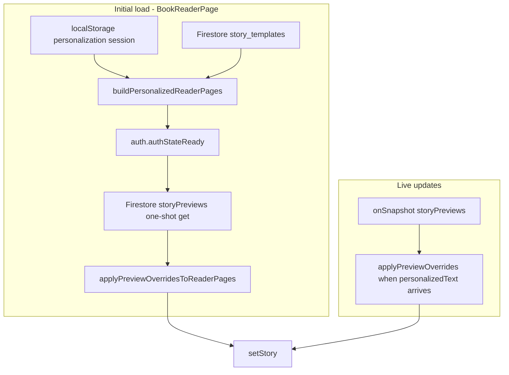

# Public Book Reader — Preview Text & Image Fix

**Date:** May 2026  
**Scope:** Caregiver public reader (`BookReaderPage`), shared personalization utilities, preview API auth alignment  
**Status:** Shipped in client + server

This document describes why the public book reader showed a blank right page (no story text), why the console flooded with `403` errors on preview API calls, and why images briefly disappeared after the first fix — plus every code change made to resolve those issues.

---

## 1. Executive summary

The public reader (`/:lang/stories/:storyId/read`) uses the same `BookSpread` component as the specialist “Preview as published book” dialog, but it **loads different data**:

| Surface | Primary text source | Primary image source |
|---------|---------------------|----------------------|
| Specialist approval preview | `stories` → `illustrationPages[].text` | Approved illustration URLs on the Story |
| Public reader (after personalize) | `story_templates` + **`storyPreviews`** | Child photo, then generated preview art |

Before this fix, the public reader only read `story_templates.pages[].textTemplate` in a narrow shape. It ignored `storyPreviews.personalizedText`, legacy `textVariants`, and `previewSpreads` fallbacks. A React effect dependency bug caused repeated failed REST calls to `GET /api/caregiver/previews/:id`, which required the `caregiver` role even though preview **creation** allowed any signed-in user.

After the fix:

- Story text resolves from multiple template shapes and merges Firestore preview content.
- Preview images load from Storage via Firestore (no reader-side REST preview fetch loop).
- Child photo is shown again on preview spreads until AI illustrations are ready.
- A live Firestore listener updates the reader when preview generation completes.

---

## 2. Symptoms (before fix)

1. **Blank right page** — Left page showed the child’s uploaded photo; right page was empty parchment (no title/body). `BookSpread` renders `page.textTemplate`; empty string produces an empty page.
2. **Specialist preview looked fine** — `PageCard` / `storyToReaderModel()` read manuscript text from the `stories` document, not `story_templates`.
3. **Console spam** — Dozens of `GET http://localhost:5001/api/caregiver/previews/{id} 403 (Forbidden)` with `ApiError: Insufficient permissions`.
4. **Regression after first text fix** — Text appeared but the child photo disappeared because catalog `previewSpreads` images were prioritized over `photoPreviewUrl`.

---

## 3. Root causes

### 3.1 Narrow text resolution

`pickTextTemplateVariant()` only accepted:

- `textTemplate: { masculine, feminine }`
- `textTemplate: string`

It returned `""` for:

- Legacy `textVariants: { male, female }` (understood by server `migrateTemplates.ts` but not the client reader)
- Empty or one-sided variant objects
- Text only in `previewSpreads[].text`, not in `pages[]`

The story detail “See inside” gallery (`PreviewGallery`) could show text from `previewSpreads` while `/read` could not.

### 3.2 Preview document ignored

After personalization, the app navigates to `/read?previewId=...` and stores `dammah.preview.{storyId}` in `localStorage`. The server writes finalized copy to:

```
storyPreviews/{previewId}/pages[].personalizedText
storyPreviews/{previewId}/pages[].generatedImagePath
```

The reader used `previewId` only for **add-to-cart**, not for loading text or illustrations.

### 3.3 Auth mismatch on GET preview

| Endpoint | Middleware | Who can call |
|----------|------------|--------------|
| `POST /api/caregiver/previews/generate` | `requireAuth` | Any signed-in Firebase user |
| `GET /api/caregiver/previews/:previewId` (before) | `requireCaregiverAuth` | Only `role === "caregiver"` |

A specialist or viewer could create a preview but not read it via REST. The client fallback then logged hundreds of 403s.

### 3.4 Auth timing

`loadPreviewReaderOverrides` ran immediately; `auth.currentUser` was often still `null` on the first paint, so preview merge was skipped once and never retried (until the snapshot effect was added).

### 3.5 Preview still generating

`POST /generate` returns quickly; pages are filled asynchronously. Opening the reader immediately often saw empty `personalizedText` until generation finished. There was no listener to refresh the UI.

### 3.6 Effect re-run loop

`fetchStory` depended on `t` (from `useTranslation()`) and `navigate`. Those identities change frequently, re-running the load effect and re-calling preview APIs on every render.

### 3.7 Image priority regression (follow-up)

An intermediate change preferred `previewSpreads[].imageUrl` **over** the child’s `photoPreviewUrl`. Catalog URLs can be missing or fail to load in ``, while the blob photo worked — so the left page looked empty even though text was fixed.

---

## 4. Solution overview



**Design choices:**

- **Firestore-first for preview content in the reader** — Matches `firestore.rules` (owner read on `storyPreviews`) and avoids REST role issues and reload loops.
- **REST GET preview aligned with POST** — `requireAuth` + `caregiverUid === req.user.uid` for other clients (cart, admin tools); not used by the reader after the loop fix.
- **Stable effect dependencies** — Story fetch keys off `storyId` and `previewIdFromQuery` only.

---

## 5. Text resolution (priority chain)

Implemented in `resolveTemplatePageText()` (`client/src/utils/storyPersonalization.ts`):

| Order | Source | Notes |
|-------|--------|-------|
| 1 | `page.textTemplate` | `{ masculine, feminine }`, `{ male, female }` keys inside object, or plain string |
| 2 | `page.textVariants` | Legacy `{ male, female }` |
| 3 | `page.text` | Plain string on template page |
| 4 | `previewSpreads[i].text` | Passed as `spreadTextFallbacks[i]` from `BookReaderPage` |

Then `personalizeStoryTemplateString()` substitutes `{{CHILD_NAME}}`, pronouns, etc.

**Preview override (after server generation):**  
`storyPreviews.pages[].personalizedText` replaces built text for matching `pageNumber` (first `PREVIEW_SPREAD_LIMIT` spreads only).

---

## 6. Image resolution (priority chain)

### 6.1 During `buildPersonalizedReaderPages` (preview spreads, index &lt; 2)

| Order | Source |
|-------|--------|
| 1 | `photoPreviewUrl` from personalization session (blob URL in localStorage) |
| 2 | `previewSpreads[i].imageUrl` (catalog illustration from publish) |
| 3 | `/story-images/placeholders/{pageNumber}.jpg` |

Spreads **beyond** the preview limit use catalog image or placeholder only (no child photo).

### 6.2 After `applyPreviewOverridesToReaderPages`

| Order | Source |
|-------|--------|
| 1 | Resolved URL from `generatedImagePath` via Firebase Storage `getDownloadURL` |
| 2 | Whatever was chosen in step 6.1 |

Storage path pattern: `preview-illustrations/{caregiverUid}/{previewId}/page-{n}.{ext}`  
Rules: read allowed when `request.auth.uid == caregiverUid`.

---

## 7. Files changed

### 7.1 Client

| File | Change |
|------|--------|
| `client/src/utils/storyPersonalization.ts` | Extended text/image helpers, types, `applyPreviewOverridesToReaderPages` |
| `client/src/utils/readerPreviewLoader.ts` | **New** — Firestore preview load + Storage URL resolution |
| `client/src/pages/BookReaderPage.tsx` | Merge preview data, auth ready, snapshot listener, stable deps |
| `client/src/pages/StoryDetail/components/PreviewGallery.tsx` | Use `resolveTemplatePageText` for consistency |
| `client/src/firebase.ts` | Export `storage` for `getDownloadURL` |
| `client/src/utils/__tests__/storyPersonalization.test.ts` | **New** — Unit tests for text/image behavior |

### 7.2 Server

| File | Change |
|------|--------|
| `server/src/routes/caregiver/previews.router.ts` | `GET /:previewId` uses `requireAuth` + owner check (was `requireCaregiverAuth`) |

### 7.3 Unchanged (but relevant)

- `client/src/components/book/BookSpread.tsx` — Still renders `page.textTemplate` and `page.imageUrl`; no layout change.
- `server/src/services/preview.service.ts` — Still writes `personalizedText` and `generatedImagePath`; reader now consumes them.

---

## 8. API and type reference (client)

### 8.1 New / updated exports in `storyPersonalization.ts`

```ts
TemplatePageTextSource       // textTemplate?, text?, textVariants?
ReaderPageBuilt              // RawReaderPage + { textTemplate: string; imageUrl: string }
PreviewReaderOverride        // { pageNumber, personalizedText?, imageUrl? }

pickTextTemplateVariant()    // Expanded: male/female keys, single-variant fallback
extractPreviewSpreadText()   // Reads text | body | content from spread object
extractPreviewSpreadImageUrl() // Reads imageUrl | image | url
resolveTemplatePageText()    // Full template + spread fallback chain
applyPreviewOverridesToReaderPages() // Merge storyPreviews into built pages
```

`buildPersonalizedReaderPages()` new options:

- `spreadTextFallbacks?: string[]`
- `spreadImageFallbacks?: Array<string | undefined>`

### 8.2 `readerPreviewLoader.ts`

```ts
loadPreviewReaderOverrides(previewId, ownerUid)  // getDoc storyPreviews
previewOverridesFromDocData(data, ownerUid)      // Used by onSnapshot
```

- Verifies `data.caregiverUid === ownerUid`
- Maps each page’s `generatedImagePath` → download URL via `getDownloadURL(ref(storage, path))`
- Does **not** call `getPreview()` REST (avoids 403 loops)

### 8.3 `BookReaderPage.tsx` behavior

**Story load effect** (`useEffect` deps: `[storyId, previewIdFromQuery]`):

1. Require completed personalization in `localStorage` (`qosati_personalization_{storyId}`).
2. Load `story_templates/{storyId}`; require `status === "approved"`.
3. Build pages with `previewSpreads` fallbacks.
4. `await auth.authStateReady()` then merge one-shot preview overrides if `previewId` + `ownerUid`.
5. Resolve cover from `coverImage` / `coverImageUrl` / first page image.

**Live preview effect** (`useEffect` deps: `[previewId, story?.id]`):

- `onSnapshot(doc(db, "storyPreviews", previewId))`
- When any override has non-empty `personalizedText`, re-apply overrides to `story.pages`

**Preview ID resolution:**

```ts
previewIdFromQuery = searchParams.get("previewId")
previewId = previewIdFromQuery || localStorage.getItem(`dammah.preview.${storyId}`)
```

---

## 9. Server change detail

**Route:** `GET /api/caregiver/previews/:previewId`

**Before:**

```ts
requireCaregiverAuth
const caregiverUid = req.caregiverUser!.uid
```

**After:**

```ts
requireAuth
const ownerUid = req.user!.uid
// 403 if data.caregiverUid !== ownerUid
```

**Rationale:** Same ownership model as `POST /generate` and `GET /quota`. Any authenticated user who owns the preview document may read it; role is not limited to `caregiver`.

**Note:** The public reader no longer depends on this endpoint; restart the API server if other tools still call GET preview.

---

## 10. Data model reference

### `story_templates` (public catalog)

```ts
pages: [{
  pageNumber: number
  textTemplate: { masculine: string, feminine: string } | string
  textVariants?: { male: string, female: string }  // legacy
  text?: string
  // ...
}]
previewSpreads?: [{ imageUrl: string, text: string }, ...]  // first 2 spreads, pre-personalization
coverImage?: string
coverImageUrl?: string  // legacy
```

### `storyPreviews` (per caregiver, after generate)

```ts
caregiverUid: string
templateId: string
pages: [{
  pageNumber: number
  personalizedText: string      // reader uses this when present
  generatedImagePath: string | null  // Storage path → download URL
}]
generationStatus: "pending" | "in_progress" | "completed" | ...
```

### localStorage personalization session

Key: `qosati_personalization_{storyId}`

```ts
{
  status: "completed",
  data: {
    childName: string
    gender: "male" | "female"
    photoPreviewUrl: string   // often blob: URL from FileReader
    // ...
  }
}
```

---

## 11. Testing

**File:** `client/src/utils/__tests__/storyPersonalization.test.ts`

Covers:

- `textTemplate` masculine/feminine selection
- Single filled variant fallback
- Legacy `textVariants`
- `previewSpreads` text fallback
- Empty `textTemplate` + spread text → personalized name in output
- Child photo preferred over catalog spread image
- `applyPreviewOverridesToReaderPages` replaces text with `personalizedText`

**Run:**

```bash
cd client
npm test -- --watchAll=false --testPathPattern=storyPersonalization
```

---

## 12. Troubleshooting

| Symptom | Check |
|---------|--------|
| Blank text on right | `story_templates.pages[0].textTemplate`, `previewSpreads[0].text`, `storyPreviews.pages[0].personalizedText` |
| No child photo | Session `photoPreviewUrl` in localStorage; blob URLs only work in same browser session |
| Photo never replaced by AI art | `storyPreviews.pages[0].generatedImagePath`; Storage rules; logged-in user must match `caregiverUid` |
| Still 403 on GET preview | Restart server after router change; reader should not call this anymore — search codebase for `getPreview(` |
| Text appears after delay | Expected — wait for `onSnapshot` when generation completes |
| Access denied on preview | `storyPreviews.caregiverUid` must equal current Firebase Auth UID |

---

## 13. Operational checklist

1. **Client:** Save changes; `npm start` hot-reload or refresh browser.
2. **Server:** Restart `npm run dev` in `server/` so GET preview auth change is active (for non-reader callers).
3. **Test flow:** Personalize → generate preview → open `/read?previewId=...` while signed in as the same user who created the preview.
4. **Verify Firestore:** Preview doc reaches `generationStatus: completed` and `pages[0].personalizedText` is non-empty.

---

## 14. Related documentation

- End-to-end caregiver flow: [CLAUDE.md](../CLAUDE.md) §5.1
- Preview service: `server/src/services/preview.service.ts`
- Template shape: `server/src/shared/types/storyTemplate.ts`
- Preview shape: `server/src/shared/types/storyPreview.ts`
- Storage rules: `storage.rules` (`preview-illustrations/...`)
- Firestore rules: `firestore.rules` (`storyPreviews`)

---

## 15. One-line summary

**The public reader wasn’t loading preview story text (wrong/missing template fields + no Firestore preview merge), and a render loop kept calling an API the user wasn’t allowed to use; image priority was corrected so the child photo shows until generated preview illustrations replace it.**
